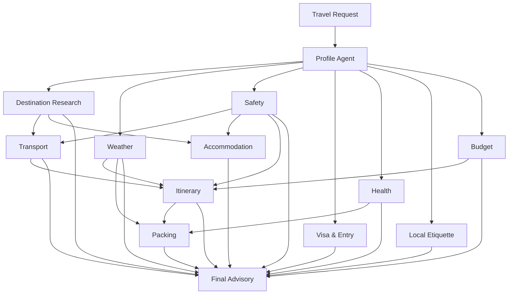

# Agentic AI Travel Advisory — 13-Agent Production-Style Starter

Hi, I’m Nagaraju. I have around 9 years of overall IT experience, with the last 5 years focused on AI/ML and Generative AI engineering.

My core experience is in building production-level GenAI, Agentic AI, RAG, and LLM-based applications using Python, FastAPI, LangChain, LangGraph, Azure OpenAI, and vector databases. I’ve worked on end-to-end RAG pipelines covering document ingestion, embeddings, semantic retrieval, prompt engineering, LLM integration, and API-based deployment.

I also have hands-on experience designing AI agents and multi-agent workflows, containerizing applications using Docker, deploying them in cloud environments, and working with CI/CD, monitoring, and MLOps practices.

i can explain you one of my recent project which i have implemented is A full FastAPI-based Agentic AI workflow for travel advisory. It uses a dependency-aware orchestration pattern, specialist agents, shared typed state, parallel execution, live-data tools with graceful fallback, streaming progress events, tests, and Docker.

## Agents

1. **Profile Agent** — traveler goals, constraints, duration and risk posture.
2. **Destination Research Agent** — country, currency, language, timezone and context.
3. **Weather Agent** — forecast retrieval and weather-impact analysis.
4. **Safety Agent** — risk controls and official-advisory verification tasks.
5. **Visa & Entry Agent** — passport, visa, transit and entry-readiness checklist.
6. **Health Agent** — conservative travel-health preparedness.
7. **Local Etiquette Agent** — language, culture and responsible-tourism guidance.
8. **Transport Agent** — flight/rail/local mobility strategy and connection risk.
9. **Accommodation Agent** — lodging scorecard and traveler-specific requirements.
10. **Budget Agent** — budget envelopes, per-person/day calculation and contingency.
11. **Itinerary Agent** — day-by-day plan using interests and upstream weather.
12. **Packing Agent** — weather-aware document, clothing, health, security checklist.
13. **Final Advisory Agent** — synthesizes all specialist outputs and preserves uncertainty.

## Workflow architecture



The implementation executes independent agents with `asyncio.gather`, then moves to downstream planning stages. This demonstrates actual orchestration/dependencies rather than a flat list of prompts.

## Project structure

```text
agentic_travel_advisory/
├── app/
│   ├── agents/              # 13 specialist agent classes
│   ├── api/routes.py        # REST + SSE endpoints
│   ├── core/                # settings + logging
│   ├── llm/                 # mock + OpenAI providers
│   ├── models/              # typed request/result/shared-state models
│   ├── orchestration/       # dependency-aware workflow
│   ├── tools/               # HTTP + travel data tools
│   └── main.py
├── data/                    # optional RAG/internal policy data
├── examples/request.json
├── tests/
├── .env.example
├── Dockerfile
├── docker-compose.yml
├── Makefile
└── requirements.txt
```

## Quick start — local mock mode

Mock mode requires no LLM key. Live Open-Meteo/REST Countries tools remain enabled unless you disable them.

```bash
python -m venv .venv
# Windows
.venv\Scripts\activate
# macOS/Linux
# source .venv/bin/activate

pip install -r requirements.txt
cp .env.example .env
uvicorn app.main:app --reload --port 8000
```

On Windows PowerShell, replace `cp` with:

```powershell
Copy-Item .env.example .env
```

Open Swagger UI:

```text
http://localhost:8000/docs
```

## Enable OpenAI mode

Edit `.env`:

```dotenv
LLM_PROVIDER=openai
OPENAI_API_KEY=your_key_here
OPENAI_MODEL=gpt-5.5
```

The provider uses the OpenAI Responses API through `AsyncOpenAI`. You can change the model name through environment configuration without changing the workflow code.

## API endpoints

### Health

```http
GET /v1/health
```

### Agent catalog

```http
GET /v1/agents
```

### Full advisory

```http
POST /v1/advisory
Content-Type: application/json
```

Example:

```bash
curl -X POST "http://localhost:8000/v1/advisory" \
  -H "Content-Type: application/json" \
  --data @examples/request.json
```

### Streaming advisory progress (SSE)

```http
POST /v1/advisory/stream
```

The SSE stream emits:
- workflow started
- stage started
- agent completed with status/confidence/duration
- stage completed
- final result

## Docker

```bash
cp .env.example .env
docker compose up --build
```

Then visit `http://localhost:8000/docs`.

## Tests

```bash
pytest -q
```

Tests inject deterministic fake travel tools, so the workflow test does not depend on the network.

## Example request fields

| Field | Meaning |
|---|---|
| `origin` | Starting city/country |
| `destination` | Destination city/country |
| `start_date`, `end_date` | Inclusive trip dates |
| `travelers` | 1–20 travelers |
| `passport_country` | Optional passport country used to personalize entry-verification tasks |
| `residency_country` | Optional current residence country |
| `budget`, `currency` | Optional total planning budget |
| `interests` | Used by itinerary agent |
| `dietary_preferences` | Traveler constraints/context |
| `mobility_needs` | Feeds transport/accommodation/health planning |
| `risk_tolerance` | `low`, `medium`, or `high` |
| `notes` | Free-text traveler preferences |

## Production enhancements you can add next

- **Authoritative visa connector**: embassy/immigration/approved travel-document provider.
- **Government safety advisory connector**: country-specific official advisory feeds.
- **Approved health connector**: official public-health/travel health data.
- **Flights/hotels**: approved GDS/OTA/inventory APIs with explicit booking controls.
- **Maps/routing**: route optimization and travel-time matrix tools.
- **RAG**: company travel policy, expense policy, destination SOPs, support knowledge.
- **Persistence**: PostgreSQL for trips, agent runs, evidence and audit trails.
- **Observability**: OpenTelemetry traces, prompt/model metrics, cost/latency dashboards.
- **Guardrails**: PII redaction, allowlisted tools/domains, output policy validation.
- **Human approval**: mandatory checkpoint before purchase/booking or high-impact changes.
- **Caching**: destination metadata/weather TTL cache to control latency and external calls.
- **Authentication**: OAuth/JWT, rate limiting, tenant isolation and secrets manager.

## Interview explanation

A strong way to explain this project:

> "I implemented the travel advisory as a dependency-aware multi-agent system. The profile agent first normalizes user constraints. Independent research agents for destination, weather, safety, visa, and health run in parallel; culture and planning agents then consume that upstream context. Their outputs become shared state for transport, accommodation, and budget planning. The itinerary and packing agents consume those upstream results, and a final lead agent synthesizes the response while preserving uncertainty and verification requirements. The service is exposed through FastAPI with typed Pydantic contracts, SSE progress streaming, graceful external-tool fallbacks, Docker, tests, and a pluggable LLM provider."

## Safety/design note

The system is intentionally designed not to turn model guesses into authoritative visa, medical, or safety claims. In production, connect those agents to approved authoritative sources and keep source timestamps/evidence in the final response.
